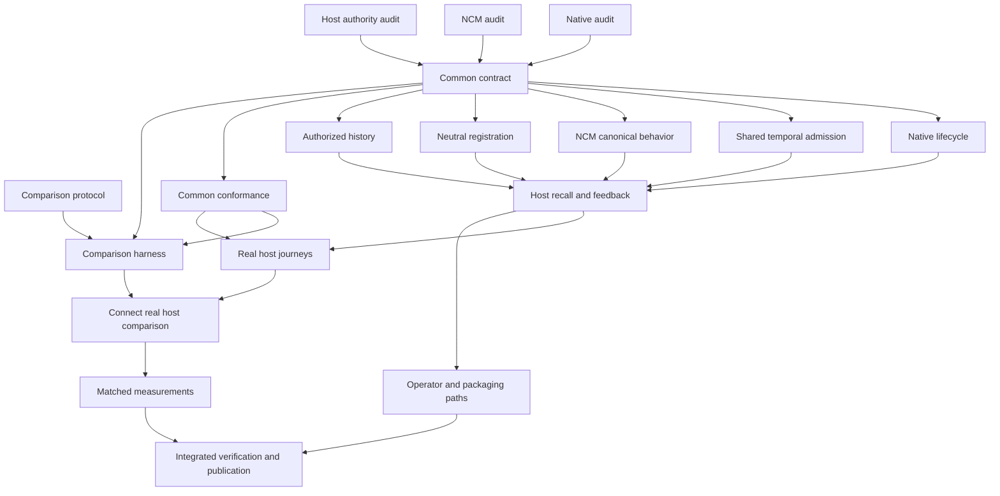

# Native / NCM completion graph

## Canonical handoff bundle

- Checkout: `/Users/satan/side/experiments/tracedecay/.worktrees/pluggable-memory-providers-v2`
- Selection: `--plans-root .codex/plans --glob 'pm-*.plan.md'`
- Graph ID: `pluggable-memory-compat-v1`
- Selection hash: `34a08b0497`
- Snapshot: `.codex/plan-graphs/pluggable-memory-compat-v1/snapshot.json`
- State directory: `.codex/plan-graphs/pluggable-memory-compat-v1`
- Operator ledger: `.codex/plan-graphs/pluggable-memory-compat-v1/operator-log.md`
- Graph tool: `/Users/satan/.codex/skills/plan-graph/scripts/plan_graph.py`
- Validation: 36 plans, 55 inter-plan edges, zero errors or warnings; strict execution-expansion validation passed. The original completion graph remains intact, with the selected-provider mount, canonical context-policy contribution and two provider-control producers extracted as independent prerequisites.
- Non-runnable documents excluded by the selection: `pm-finish-brief.md`, this orchestration document, audit evidence and comparison protocol documents. They are inputs, not orphaned plan nodes.

Use this exact edge overlay with the selection for validate, summary, frontier or DAG commands:

```text
--depends pm-native-audit:pm-contract
--depends pm-ncm-audit:pm-contract
--depends pm-host-audit:pm-contract
--depends pm-contract:pm-native
--depends pm-contract:pm-admission
--depends pm-contract:pm-dependency-checks
--depends pm-dependency-checks:pm-integrate
--depends pm-admission:pm-host-recall
--depends pm-contract:pm-ncm
--depends pm-contract:pm-ncm-portability
--depends pm-ncm-restore-identity:pm-ncm-portability
--depends pm-ncm-portability:pm-host-recall
--depends pm-contract:pm-registration
--depends pm-contract:pm-history
--depends pm-contract:pm-live-origin
--depends pm-live-origin:pm-host-recall
--depends pm-contract:pm-conformance
--depends pm-contract:pm-comparison-harness
--depends pm-eval-protocol:pm-comparison-harness
--depends pm-conformance:pm-comparison-harness
--depends pm-native:pm-host-recall
--depends pm-ncm:pm-host-recall
--depends pm-registration:pm-host-recall
--depends pm-registration:pm-host-mount
--depends pm-host-mount:pm-host-recall
--depends pm-contract:pm-context-policy
--depends pm-context-policy:pm-host-recall
--depends pm-contract:pm-provider-control-contract
--depends pm-registration:pm-provider-control-routing
--depends pm-provider-control-contract:pm-host-recall
--depends pm-provider-control-routing:pm-host-recall
--depends pm-history:pm-host-recall
--depends pm-host-recall:pm-host-journeys
--depends pm-conformance:pm-host-journeys
--depends pm-host-recall:pm-operations
--depends pm-host-journeys:pm-comparison-connect
--depends pm-comparison-harness:pm-comparison-connect
--depends pm-comparison-connect:pm-measure
--depends pm-measure:pm-integrate
--depends pm-operations:pm-integrate
--depends pm-ncm-cancel:pm-ncm
--depends pm-ncm-delete-guard:pm-ncm
--depends pm-native-integrity:pm-native
--depends pm-ncm-restore-identity:pm-ncm
--depends pm-heldout-a:pm-comparison-harness
--depends pm-heldout-b:pm-comparison-harness
--depends pm-heldout-c:pm-comparison-harness
--depends pm-measurement-capture:pm-comparison-harness
--depends pm-conformance:pm-conformance-factories
--depends pm-conformance-factories:pm-conformance-native
--depends pm-native:pm-conformance-native
--depends pm-conformance-factories:pm-conformance-ncm
--depends pm-ncm:pm-conformance-ncm
--depends pm-conformance-native:pm-measure
--depends pm-conformance-ncm:pm-measure
```

Append `--graph-id pluggable-memory-compat-v1 --state-dir .codex/plan-graphs --write-state`. Use `--format json` for the handoff/frontier, `--format mermaid` for the full todo graph. Plans contain sequential todos; the overlay joins each source plan's last todo to each target's first.

## Goal and limits

Finish two independently selectable, behaviorally compatible memory providers and publish an honest matched comparison. See `pm-finish-brief.md` for the completion contract.

Resolved Codex configuration: **50 threads, depth 3**, from `/Users/satan/.codex/config.toml`. This graph uses **four first-wave source/protocol lanes**, then up to **five disjoint implementation lanes** plus root and one independent checker when useful. All spawned agents are leaves; deeper spawning is not authorized by this graph. More threads cannot shorten the single shared-contract/host-integration chain. Root reserves the compiler/model lane and final decision-making.

## Waves and merge points



1. **Wave 1 completed:** Native audit, NCM audit, host audit and comparison protocol produced separate reviewed evidence/protocol documents with production source read-only. A second read-only graph review identified missing source/fact ownership and the real-host fixture dependency; those corrections are incorporated here.
2. **Wave 2:** root settles the shared semantics and directs one contract execution worker. An independent read-only checker challenges scope, deletion/replay and temporal semantics before consumers start. This is one shared interface owner, not parallel interface edits.
3. **Wave 3:** Native, NCM, neutral registration, authorized history and conformance execute in parallel on disjoint files. Root reviews/integrates checkpoints and runs one shared heavy check at a time. Once conformance and protocol are complete, the comparison harness replaces that completed lane.
4. **Wave 4:** one coherent host recall/feedback integration owner consumes the four producers. Adapter defects return to their original owners; no competitor edits their files. First checkpoint is an actual nonempty NCM answer through host admission, then complete lifecycle/cancellation.
5. **Wave 5:** real host journeys and operator/packaging work proceed on distinct files. Once both the prepared harness and reusable real host-control fixture are complete, `pm-comparison-connect` binds them and proves a real positive/negative smoke through both providers.
6. **Wave 6:** root runs paired quality and performance populations after the real comparison connection. A read-only reviewer checks samples, denominators and attribution. Root fixes concrete defects through scoped owners and publishes after focused aggregate verification.

Critical path: **completed source audits → common contracts → longest of Native/NCM/history/registration → real host recall → host journeys → real comparison connection → measured comparison → final integration**. Evaluation design, generic conformance and runner preparation overlap this path wherever their inputs are stable.

## Ownership and stop boundaries

| Node | Owner responsibility | Output / stop condition |
|---|---|---|
| pm-native-audit | Native adapter/application/staged store source reads | `pm-native-evidence.md`; exact methods, migration and tests; no Rust edits |
| pm-ncm-audit | NCM adapter/runtime source reads | `pm-ncm-evidence.md`; request/response and persistent source mapping; no Rust edits |
| pm-host-audit | Registry/config/history/provenance source reads | `pm-host-evidence.md`; actual neutralization seam and source authority; no Rust edits |
| pm-eval-protocol | Existing corpus/evaluation/benchmark source and docs | `pm-comparison-protocol.md`; matched inputs, metrics and bounded trial design; no runs |
| pm-contract | Shared provider API and canonical wire contracts | Reviewed common profile and validated typed producer/consumer seam |
| pm-admission | Existing contract writer; registry temporal/source admission and focused tests | Frozen API consumer; runs alongside five producers and precedes host integration |
| pm-native | Native adapter plus `native_provider.rs` / `native_staged_observations.rs` and direct tests | Real required lifecycle and time behavior; no host/NCM changes |
| pm-ncm | NCM adapter/runtime and direct tests | Canonical nonempty admissible recall plus persistent lifecycle; no Native/host changes |
| pm-registration | Registry lifecycle and configuration declaration/parsing | Independent active selection; exact root composition patch handed back |
| pm-history | Existing canonical source/disposition ports, new focused host history module, observation journey and journal deletion fences | Own identity bridge and durable provider-local deletion intent, then authorized replay; no adapter internals |
| pm-conformance | Neutral fixture/runner/adversarial tests | One unchanged real-provider assertion suite; no provider exemptions |
| pm-comparison-harness | Evaluation crate and comparison runner scripts | Prepared action/capture interfaces and honest report checks; no real-host completion claim or benchmarks |
| pm-comparison-connect | Same runner files after harness preparation and reusable host journey fixture finish | Real host connection and bounded smoke; no provider edits or held-out runs |
| pm-host-recall | Serialized root composition/cognitive recall and registry recall pipeline | Both real providers admitted through one path; no producer redesign |
| pm-host-mount | Same serialized host owner, starting after completed registration | Selected descriptor-driven mount and retained real history pair; no history dispatch yet |
| pm-context-policy | Separate canonical-lane owner before host merge | Public time/exclusion fields, typed fact contribution and explicit temporal withholding; no advisory edits |
| pm-provider-control-contract | Existing contract owner, separate retained family | Nine typed provider-local operations and independent port, without canonical fact mutation |
| pm-provider-control-routing | Existing registration owner, registry/fabric only | Exact original-provider controls with shared admission and retained host profile policy |
| pm-host-journeys | Existing real CLI host journey plus focused shared fixtures | Two-provider positive and negative lifecycle matrix |
| pm-operations | Explicitly assigned operator CLI/docs/packaging patches | Tested selection/disable/rollback instructions; no operator installation |
| pm-measure | Root-only heavy run plus independent read-only results reviewer | Paired real results and visible failures; no threshold tuning |
| pm-integrate | Root | Coherent reviewed commits/push and truthful completion |

## Conflict controls

- Root is the only live owner of workspace manifests/lockfiles, `.config/nextest.toml`, plan statuses, central composition integration and publication. When root hands a serialized composition slice to an execution worker, root stops editing those files until its reviewed return.
- API/schema contracts have one writer and finish before adapter workers edit consumers.
- `native_provider.rs` and `native_staged_observations.rs` belong to Native; `observation_journey.rs` belongs to history. Shared helper requests route through root.
- History also owns the source-port and journal-fence files explicitly listed in `pm-history.plan.md`; root reviews their exact existing-authority changes before execution. This resolves the missing producer from the audit instead of leaving it as an unstated root prerequisite. Historical fact handling is owned by host recall; common advisory output excludes legacy canonical fact projection, so Native does not need a new canonical fact history implementation.
- Shared `tracedecay-contracts/src/memory/recall.rs` and retained control declarations belong to the contract writer. `scenario_corpus.rs` belongs to conformance. Public host control dispatch and typed canonical fact metadata belong to host recall; the later operations lane only exposes the completed controls.
- Registry registration/lifecycle files are separate from registry recall admission/provenance/packing files. Shared temporal/source admission is assigned to pm-admission after API freeze; the remaining recall port/packing files are written only during the host recall wave.
- The CLI host journey fixture belongs only to its journey owner. Operator work gets an exact do-not-edit list excluding it. No two lanes simultaneously change the same test helper or `baseline.rs`.
- Workers may prepare exact patch suggestions for root-owned files, never apply them independently. Every worker is told it is not alone and must preserve others' edits.
- All agents report changed files, actual verification, residual failures and a bounded next handoff. Stop at the node outcome; do not invent neighboring scope.
- Root integrates finished slices promptly, reruns the same selected graph frontier, and launches newly unblocked work without waiting for unrelated lanes. Switch live orchestration to the `helm` skill once workers are active.

## Verification discipline

One heavy Cargo/model process at a time, session `codex-product-resume`, same checkout target and installed model artifacts. Scoped type/schema/conformance checks at interface merge points; real host tests in the existing exclusive subprocess group; matched performance only after correctness. Positive source/effect assertions, unknown/partial accounting and independent result review are required. No repeated full-workspace suite solely because a plan node or receipt changed.

Current execution expansion: the user explicitly authorized implementation and maximum useful subagent parallelism. In addition to the ready contract node, eight independent lanes now cover existing-contract NCM cancellation/deletion/restore identity, Native stored-content integrity, three disjoint held-out fixture batches, and process measurement capture. Their exact scopes live in the new plans above; each feeds its later implementation owner, preventing overlap. All remain leaves. Root performs the shared-contract decisions while these lanes execute, then launches the five main producers after contract validation. The previous five-worker heuristic is superseded for this explicit independent fan-out; the hard limit remains 50 threads/depth 3 and one heavy process.

The shared admission consumer is now a separate node: implementation of registry temporal/source semantics can overlap the five main providers/host producers once the API and wire schema are reviewed and type-tested. Its owner remains the contract worker, with no second concurrent writer. This avoids blocking every provider on an unchanged host admission function while preserving the real integration prerequisite.

Live origin producer pm-live-origin owns only durable hook admission metadata and the live hook boundary. It runs beside pm-history, which owns the disjoint session proof-reader and replay consumer; both join at host recall. The source-origin audit exposed this required producer during implementation.

NCM portability now has a disjoint execution owner for two new modules. Main NCM owner retains all wrapper/runtime integration files and applies reviewed hookup hunks, with no concurrent writer.

Dependency-check repair is an independent enforcement lane: checker scripts plus one footprint rule; root retains architectural policy/manifests. It joins final integration and never relaxes the host/adapter capability floors.

The tested registration seam now permits its narrow selected-provider mount consumer to run independently of the final recent-history/receipt producer. pm-host-mount extracts that first host todo and retains one serialized host owner for the later pm-host-recall work. This changes neither the end-to-end prerequisites nor the required host journey proof.

The retained control DTOs and fabric routing are now two disjoint prerequisites extracted from the host lifecycle todo. They overlap the serialized public recall integration; root retains all source-attribution and dispatcher decisions. Prepared host journey patches remain unapplied until the public typed attribution producer is complete.

Real adapter conformance is separated from CLI journey evidence. The public context projection cannot faithfully supply raw protocol replies or suite-owned canonical identities. Shared fixture authority/transport feeds concrete Native and production-worker NCM factories; all actual provider replies remain unchanged. Foreign-scope isolation may be an explicit effect-free scope mismatch, never an unrelated unavailable result.

Factory ownership: pm_conformance_impl owns shared real-fixture support and shared foreign isolation semantics; pm_native_impl owns only the Native process factory test; pm_ncm_impl owns only the production NCM factory integration test. All drafts are unapplied during cc1347.
